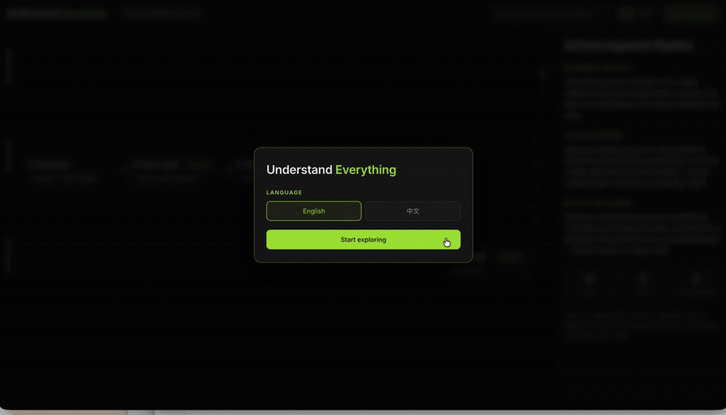

# Understand Everything

**Turn any project into an interactive system map you can explain clearly—in interviews, at work, and to people without a technical background.**

## The Problem

AI can help you build a working product before you fully understand the system behind it. That becomes a problem when an interviewer asks why you chose a certain architecture, a teammate asks what will break after a change, or a non-technical stakeholder needs the project explained without code and jargon.

File trees and dependency graphs show where code lives. They do not teach you how to tell the story of what your project does, why it was designed that way, and what tradeoffs you made.

## The Solution

Understand Everything scans a project and turns it into a plain-language map of 5–15 meaningful parts, organized as **Frontend / Backend / Database**. Each part explains its role, user impact, dependencies, source evidence, failure points, and important technical decisions.

The dashboard runs locally, supports instant **English / 中文** switching, and guides you through the system in data-flow order—so you can understand your project and explain it to someone else.

   

[](docs/understand-everything-demo.mp4)

[Watch the full demo video](docs/understand-everything-demo.mp4)

---

## Features

- **System map, not a file tree** — groups the project into 5–15 parts a person can actually remember
- **Plain-language explanations** — tells you what each part does, how it affects the product, and what happens when it breaks
- **Technical decisions and tradeoffs** — explains what was chosen, what the alternative was, the cost, and when to switch
- **Guided data-flow tour** — walks through the project in order and highlights upstream and downstream dependencies
- **Bilingual by default** — switches between English and Chinese instantly
- **Local-first analysis** — uses the AI coding agent you already have; the map and dashboard stay on your machine

---

## How It Works

```text
Run explain-my-app inside a project
               ↓
Scan the stack and identify the important files
               ↓
Turn the system into 5–15 meaningful parts
               ↓
Validate the bilingual app map
               ↓
Open the local dashboard and follow the guided tour
```

---

## Quick Start

### Claude Code

```text
/plugin marketplace add Jia0612/understand-everything-for-beginners
/plugin install understand-everything
```

Then run inside any project:

```text
/explain-my-app
```

### Codex, Gemini CLI, OpenCode, Cursor, or VS Code Copilot

For Codex:

```bash
curl -fsSL https://raw.githubusercontent.com/Jia0612/understand-everything-for-beginners/main/install.sh | bash -s codex
```

Use `gemini`, `opencode`, `cursor`, `vscode`, or `copilot` instead of `codex` for the other supported tools.

Restart the tool, then ask it to use `explain-my-app`. Codex users can run:

```text
$explain-my-app
```

### Open an existing map

From a project that already contains `.ue/app-map.json`:

```bash
npx understand-everything
```

---

## Project Structure

```text
├── plugin/skills/explain-my-app/   # Scanner, generation rules, and validation
├── packages/core/                  # app-map.json schema
├── packages/dashboard/             # React + Vite interactive map
├── cli/                            # npx understand-everything local server
├── adapters/                       # Instructions for non-Claude agents
├── tests/                          # Scanner, schema, dashboard, CLI, and installer tests
└── docs/
    ├── understand-everything-demo.gif
    └── understand-everything-demo.mp4
```

---

Inspired by [Understand Anything](https://github.com/Egonex-AI/Understand-Anything). Both projects are licensed under MIT.

Built by [Riley Xiong](https://github.com/Jia0612)
